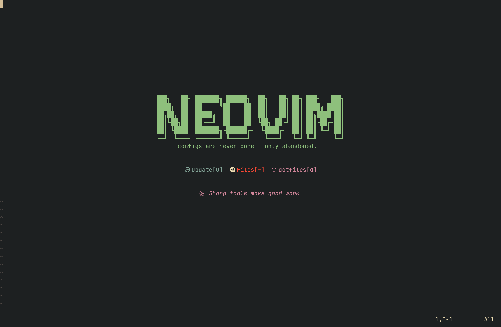
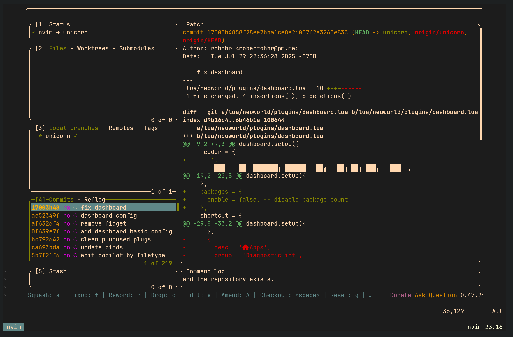
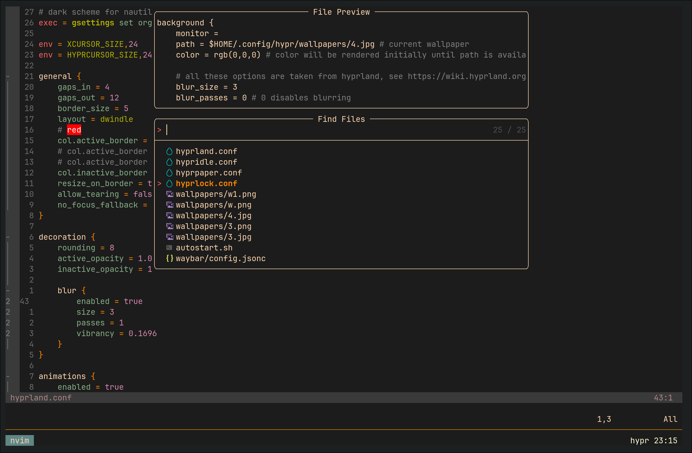
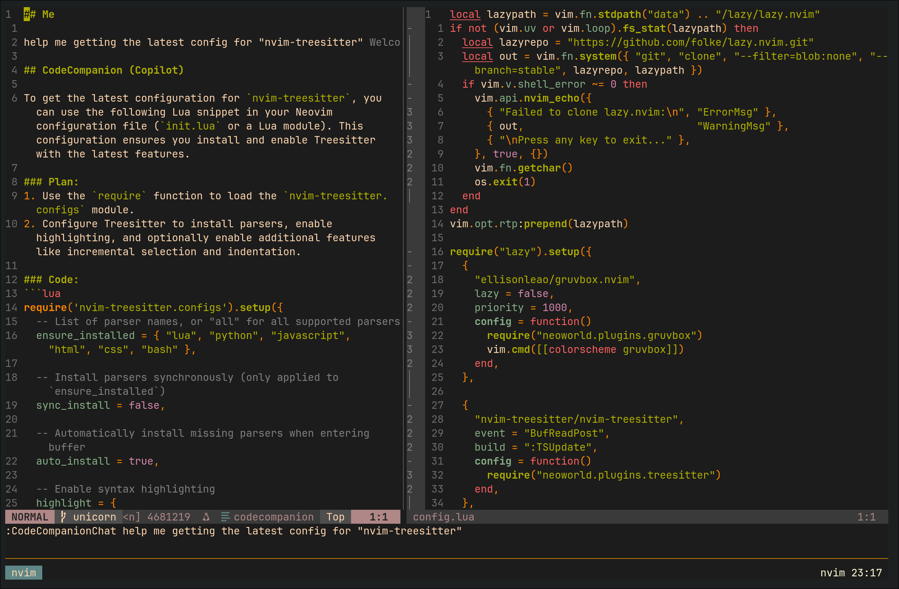
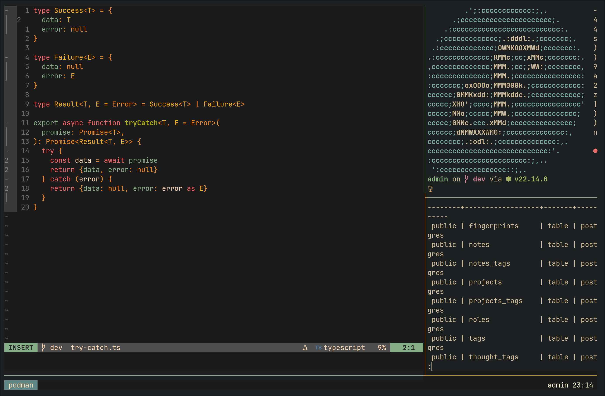
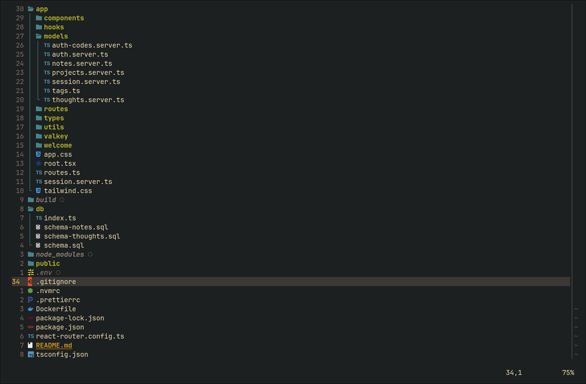
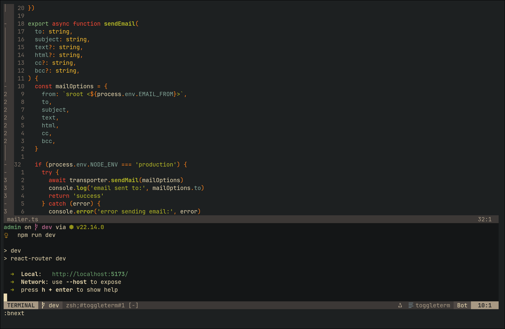

<h1 align="center">neovim config</h1>

 

## Showcase

## Feature list

- [gruvbox](https://github.com/ellisonleao/gruvbox.nvim) theme, light & dark config
- toggle terminal buffers, statusline
- file navigation with [nvim-tree.lua](https://github.com/nvim-tree/nvim-tree.lua)
- git diff with [gitsigns.nvim](https://github.com/lewis6991/gitsigns.nvim) and [lazygit](https://github.com/kdheepak/lazygit.nvim) integration
- LSP configuration with [nvim-lspconfig](https://github.com/neovim/nvim-lspconfig) and [mason.nvim](https://github.com/williamboman/mason.nvim)
- Autocompletion with [nvim-cmp](https://github.com/hrsh7th/nvim-cmp)
- AI integration with [codecompanion](https://github.com/olimorris/codecompanion.nvim)
- File searching, previewing text files, etc. with [telescope.nvim](https://github.com/nvim-telescope/telescope.nvim).
- Syntax highlighting with [nvim-treesitter](https://github.com/nvim-treesitter/nvim-treesitter)
- Autoclosing brackets and tags with [nvim-autopairs](https://github.com/windwp/nvim-autopairs)

